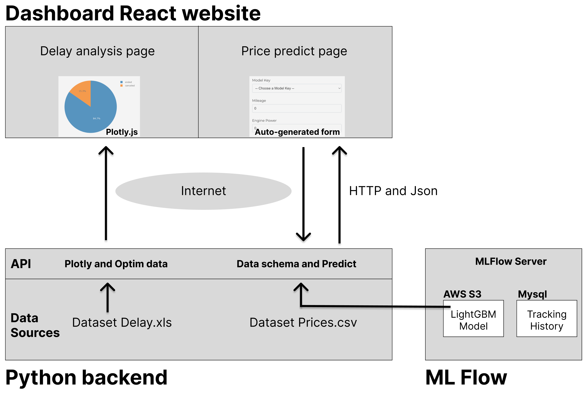

# Getaround analysis and price prediction

**Video:** https://share.vidyard.com/watch/9u5oj8PAvU54HovXua7jr6

* **Dashboard demo URL:** https://dashgetaround.pages.dev
* **API demo URL:** https://apigetaround.mldatago.com/docs

Objectives of this project are:
* To analyze the delay of checkout by rental. And provide tools to estimate the best time gap to allow between each car rental.
Data source: `get_around_delay_analysis.xlsx`

* To create a machine learning model and api which can estimate the optimal rental price per day for a car and its options
Data source: `get_around_pricing_project.csv`

Notebooks are for delay analysis: `delay_analysis_final.ipynb` and for price prediction: `price_optimization.ipynb`



Models for price prediction were train with Sklearn and performances tracked by MLFlow. Results are available here: https://mlflow.mldatago.com/ The final model is a LightGBM and store in a S3 through the MLFlow artifacs API.

About deployment, the frontend is a dashboard is available in `dashboard` directory. It's a React app (static website). The dashboard shows the results of delay analysis and offers a UI to make prices prediction through a form.
The backend is an API in FastAPI.

## Installation

### API (on Mac/Linux)
1. Download the project locally

2. Install Python modules
```sh
pip install -r requirements.txt
```

3. Optionally:
Edit `api/config.py` to change Mlflow URI and Model key

4. Run the API server:

**Development:**
```sh
cd api
uvicorn api:app --reload --host 0.0.0.0 --port 8081
```

**Production:**
```sh
cd api
gunicorn -w 2 -k uvicorn.workers.UvicornWorker api:app -b :8081
```

### Dashboard
1. Install NodeJS: https://nodejs.org/en/download/
2. From project root, go to dashboard directory:
```sh
cd dashboard
```

**Development:**
* Create `.env` file with the URL of the API. Example with api in localhost:
`REACT_APP_URL_API=http://127.0.0.1:8081`

* Execute
```sh
npm install
npm run start
```

**Production:**

* Create `.env` file with the URL of the API.
`REACT_APP_URL_API=[URL API]`

* Execute
```sh
npm install
npm run build
```
* Not recommended: `npm install -g serve` and `serve -s build -l 4000` (change port 4000 with the value you want)
  OR
* Recommended: Upload the `build` directory content to a static http server
